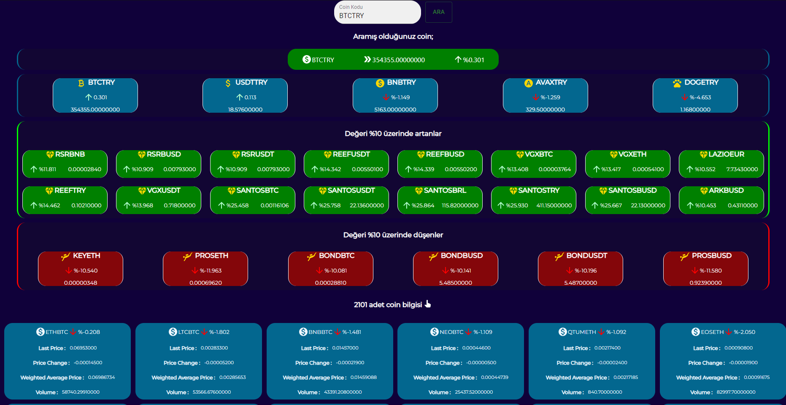
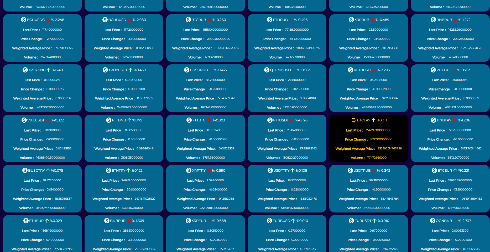

# REALTIME CURRENCY RATES APPLICATION

<h3>Ana Sayfa / Main Page</h3>

    Sayfa yüklendiğinde Binance api hizmetinden 2101 adet coinin gerçek zamanlı bilgileri alınır.
    JSON formatında alınan veriler filtreler aracılığı ile kullanıcıya aktarılır.
    Kullanıcı dilerse kendi istediği coini, coin kısaltmasıyla ( "BTCTRY" ) aratarak ulaşabilir.
    Ayrıca %10 üzerinde artış veya azalış durumunda olan coinler kullanıcıya otomatik gösterilir.
    Dilerse 2101 adet coinin tamamını sayfanın alt kısmında görebilmektedir.
    Binance şirketinin api servisine yapılan isteklerde güvenlik sebebiyle kısıtlamalar koyması sebebiyle verilerin güncellenmesi 30 saniye olarak ayarlanmıştır.
    Bu süreyi 10 saniyeye kadar indirmek mümkün, aksi halde binance firması fazla istek gönderilmesi durumunda ip'ye engelleme uygulayabiliyor.

    When page compiled, we get 2101 realtime currency data from Binance api service.
    We provide data to customer through filters which is type of JSON data.
    If customer wants to search his/her currency, they can search with currency shortcut like (“BTCTRY”).
    So, there is automatically displayed coin values which is increase or decrease on %10.
    Then optional one, customers can see all coins data which is includes 2101 coin datas downside of the page.
    Sometimes requests increase than Binance procedures. For this reason we set refresh time 30 seconds.
    We able to set to 10 seconds.
    But sometimes Binance blocking our ip address, this is risk.

<h3>2101 adet coin / Amount of currency datas is 2101</h3>

    2101 adet coinin tamamına 30 saniye güncelleme süresiyle ulaşılabiliyor.
    Dilerseniz süreyi değiştirebilirsiniz.
    
    Able to reach 2101 currency rates with 30 seconds period.
    Setting time is option.
    

